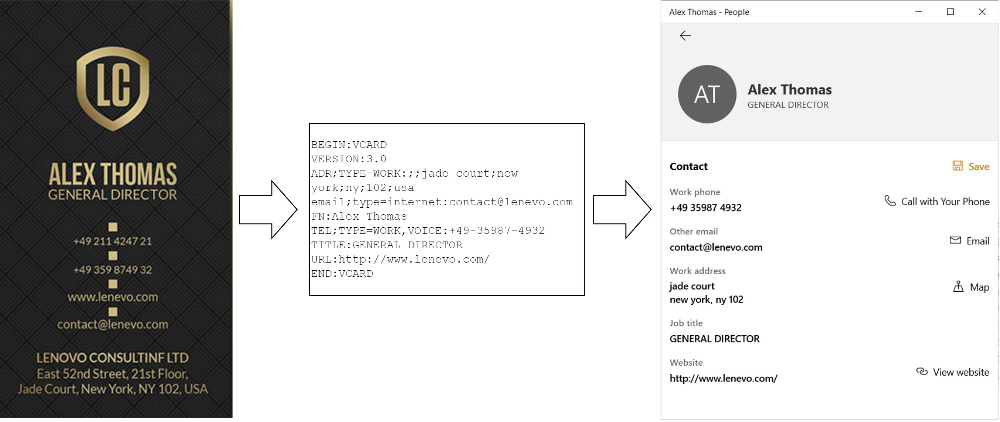

## **Introducing new AI features**
### **1. Business card recognition**
This is a business card scanner, which allows you to convert captured business card and name card images into a vCard format to store contacts. Convert images into VCard file.

Now you can use artificial intelligence functionality for creating email applications that work with standard email file formats. There are two ways to parse business cards using the Business card recognition API – with cloud storage or not.
### **2. Name API for parsing and handling personal names**
This is a modern approach, which provides you numerous useful functions to process names:

- Parse name of a person into parts (First name, Surname, etc.).
- Process the name of a person to determine the gender.
- Format a person’s name using a specific format.
- Compare a list of names to determine whether they belong to the same person.
- Expand a person's name into a list of possible alternatives
- Get several different names, starting with certain letters.
- Parse out person's name from an email address.
- See AI features usage tutorials for all supported SDKs: [Name API](/email/name-api/) and [Business card recognition](/email/business-cards-recognition/).
## **SDK changes**
- All SDKs now have full-reference documentation in markdown files (including PHP and Typescript SDKs).
- PHP SDK model names fixed (classes renamed according to the code style).
- Added type hints to Ruby SDK.
- Constructors with parameters added to Models in C#, Java, PHP SDKs.
- Added examples and autotests.
- Resolved bugs with file handling in Typescript, PHP SDKs.
- Enum handling improved, all accepted values enumerated in documentation.
