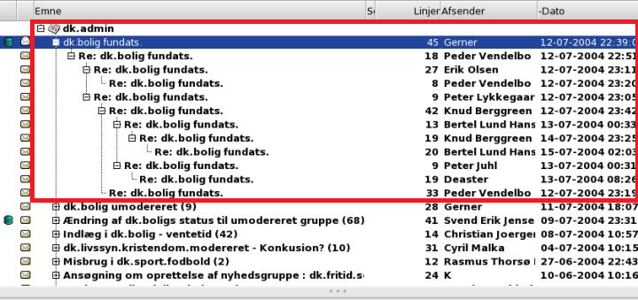

## Message Threads ##

This tutorial is about **manipulating message threads using [Aspose.Email Cloud](https://products.aspose.cloud/email/family) build-in client.**

{} 

You may ask '*Is there any difference between messages and threads?*'. At first glance, the difference is not obvious, but there is.

- **Messages**. The most important entity when you create an email application. The message contains email’s body, attachments, sender, recipients, metadata and other useful pieces of information.
- **Threads**. Messages, collected together with a variety of parameters are called threads. Using threads, you can get more structured emails in the mailbox.

{} 

Using threads, you can easily structure emails in the mailbox. Instead of working with an unstructured list of messages, it is better to work and analyze only certain threads of emails. In the picture below you can see how the messages are arranged in threads:


## **Built-In Email Client**
[**Aspose.Email Cloud API**](https://products.aspose.cloud/email/family) provides a [built-in email client](/email/quick-start-with-email-client/) with a unified API, which supports different account types like **SMTP**, **POP3**, **IMAP**, **EWS**.


{} 

- Setup SDK, using tutorial: [**SDK setup**](/email/sdk-setup/).
- Setup your email client accounts, using tutorial: [**Quick Start With Email Client**](/email/quick-start-with-email-client/).

{} 

Threads support by protocols:

- **Exchange Web Services (EWS)** **Accounts**: native support, no extra configuration needed. Exchange Web Services is an alternative to the MAPI protocol. EWS is used by the latest version of Microsoft Outlook for Mac and Microsoft Entourage for Mac.
- **POP3**: thread support is implemented using message cache. Message cache location on storage should be specified. The Post Office Protocol allows manipulating the user's client application with a mailbox supported on a mail server.
- **IMAP**: thread support is implemented using message cache, at the moment. Native threads support will be implemented in a future version. The Internet Message Access Protocol is the Internet protocol that allows an email client to access emails on a remote mail server.
- **WebDav**: threads are not supported.
- **Virtual Multi-account**: gets threads from underlying accounts and provides them as is.
## **Thread Support using Message Cache**
Aspose.Email Cloud [built-in email client](/email/quick-start-with-email-client/) supports native threads for **EWS** and **IMAP** accounts. For **POP3** accounts we provide this functionality using our own threads implementation. This implementation uses messages’ cache, located on [Aspose Storage](https://apireference.aspose.cloud/storage/) and our own threads algorithm, which generates threads based on message subject and participants.

Message cache is also used for **IMAP** accounts if the **IMAP** server does not provide native threads.

To support threads using cache, you should provide cache location during email account setup:

**Setup account with cache file**





```cs
var account = new EmailClientAccount
{
    Host = "pop.gmail.com",
    Port = 995,
    ProtocolType = "POP3",
    SecurityOptions = "SSLAuto",
    Credentials = new EmailClientAccountPasswordCredentials
    {
        Login = "example@gmail.com",
        Password = "password"
    },
    CacheFile = new StorageFileLocation("First storage", "cache/location/on/storage", "account.cache")
};
const string accountFile = "email.account";
const string storage = "First storage";
const string folder = "account/location/on/storage";
var accountLocation = new StorageFileLocation(storage, folder, accountFile);
await api.Client.Account.SaveAsync(new ClientAccountSaveRequest(
    accountLocation, account));
```





```java
EmailClientAccount account = new EmailClientAccount(
    "pop.gmail.com", 995, "SSLAuto", "POP3",
    new EmailClientAccountPasswordCredentials("example@gmail.com", "password"),
    new StorageFileLocation("First storage",
        "path/to/cache/location/on/storage", "account.cache"));
String accountFile = "email.account";
String storage = "First storage";
String folder = "account/location/on/storage";
StorageFileLocation accountLocation = new StorageFileLocation(
    storage, folder, accountFile);
api.client().account().save(new ClientAccountSaveRequest(
    accountLocation, account));
```





```py
account = models.EmailClientAccount(
    'pop.gmail.com', 995, 'SSLAuto', 'POP3',
    models.EmailClientAccountPasswordCredentials(
        'example@gmail.com', 'password'),
    models.StorageFileLocation('First storage', 'cache/location/on/storage',
                               'account.cache'))
account_file = 'email.account'
storage = 'First storage'
folder = 'account/location/on/storage'
account_location = models.StorageFileLocation(
    storage, folder, account_file)
api.client.account.save(models.ClientAccountSaveRequest(
    account_location, account))
```





```rb
account = EmailClientAccount.new(
  host: 'pop.gmail.com',
  port: 995,
  security_options: 'SSLAuto',
  protocol_type: 'POP3',
  credentials: EmailClientAccountPasswordCredentials.new(
    login: 'example@gmail.com',
    password: 'password'),
  cache_file: StorageFileLocation.new(
    storage: storage,
    folder_path: folder,
    file_name: 'account.cache'))
account_file = 'email.account'
account_location = StorageFileLocation.new(
  storage: storage,
  folder_path: folder,
  file_name: account_file)
api.client.account.save(
  ClientAccountSaveRequest.new(
    storage_file: account_location,
    value: account))
```





```ts
const accountCredentials =
    new EmailClientAccountPasswordCredentials(
        'example@gmail.com', 'password');
const account = new EmailClientAccount('pop.gmail.com', 995, 'SSLAuto', 'POP3',
    accountCredentials,
    new StorageFileLocation('First storage', 'cache/location/on/storage', 'account.cache'));
const accountFile = 'email.account';
const storage = 'First storage';
const folder = 'account/location/on/storage';
const accountLocation = new StorageFileLocation(
    storage, folder, accountFile);
await api.client.account.save(new ClientAccountSaveRequest(
    accountLocation, account));
```





```php
$account = new EmailClientAccount('pop.gmail.com', 995, 'SSLAuto', 'POP3',
    new EmailClientAccountPasswordCredentials('example@gmail.com', 'password'),
    new StorageFileLocation($storage, $folder, 'account.cache'));
$accountFile = 'email.account';
$accountLocation = new StorageFileLocation($storage, $folder, $accountFile);
$api->client()->account()->save(new ClientAccountSaveRequest(
    $accountLocation, $account));
```





The **account.cache** file contains basic information about messages and threads (*folder, subject, message identifiers, dates* and *participants*).

{} 

Using **account.cache** file has some restrictions:

- The file will be created automatically during [**EmailCloud.Client.Thread.GetList**](/email/reference-client-thread-api/#getlist) call if updateFolderCache is set to true.
- [**GetList**](/email/reference-client-thread-api/#getlist) caches only messages for folders that were requested. So, to initialize cache for several folders, you should call [**GetList**](/email/reference-client-thread-api/#getlist) for every single folder. Folder cache initialization takes more time than updating cache in the future.
- [**GetList**](/email/reference-client-thread-api/#getlist) is the only way to sync messages with the account. It finds all messages that were not cached before, and adds them to the existing threads or creates new ones. [**GetList**](/email/reference-client-thread-api/#getlist) also removes messages from the cache if they were removed from the account.
- [**GetList**](/email/reference-client-thread-api/#getlist), [**Delete**](/email/reference-client-thread-api/#delete), [**Move**](/email/reference-client-thread-api/#move) methods lock **account.cache** file while processing. So, these methods will never run in parallel.
- [**Delete**](/email/reference-client-thread-api/#delete) and [**Move**](/email/reference-client-thread-api/#move) methods delete/move messages in the email account and also update information about affected messages in **account.cache** file.
- [**GetMessages**](/email/reference-client-thread-api/#getmessages) method does not update and lock **account.cache** file, this method returns only messages that exist in the cache.

{} 
## **Get List of Threads**
To get the list of threads for a given folder (folder parameter is ignored for **POP3** accounts), use [**GetList**](/email/reference-client-thread-api/#getlist) method from [**ClientThreadApi**](/email/reference-client-thread-api/):





```cs
const string inbox = "INBOX";
EmailThreadList threads = await api.Client.Thread.GetListAsync(
    new ClientThreadGetListRequest(
        inbox, accountFile, storage, folder, true, 200));
```





```java
String inbox = "INBOX";
EmailThreadList threads = api.client().thread().getList(
    new ClientThreadGetListRequest(
        inbox, accountFile, storage, folder, true, 200));
```





```py
inbox = 'INBOX'
threads = api.client.thread.get_list(models.ClientThreadGetListRequest(
    inbox, account_file, storage, folder, True, 200))
```





```rb
inbox = 'INBOX'
threads = api.client.thread.get_list(ClientThreadGetListRequest.new(
  folder: inbox,
  account: account_file,
  storage: storage,
  account_storage_folder: folder,
  update_folder_cache: true,
  messages_cache_limit: 200))
```





```ts
const inbox = 'INBOX';
const threads = await api.client.thread.getList(
    new ClientThreadGetListRequest(
        inbox, accountFile, storage, folder, true, 200));
```





```php
$inbox = 'INBOX';
$threads = $api->client()->thread()->getList(
    new ClientThreadGetListRequest(
        $inbox, $accountFile, $storage, $folder, true, 200));
```





Set parameter **updateFolderCache** to **false** if you don't need to sync threads cache with your email account.
## **Fetch Thread Messages**
**GetList** method returns all email threads from the folder. All threads contain a lists of messages. However, these messages contain only basic information: *MessageId, Date, Subject, Participants* (*From, To, CC*). Use [**GetMessages**](/email/reference-client-thread-api/#getmessages) method from [**ClientThreadApi**](/email/reference-client-thread-api/) if you need to fetch full messages for a thread, including message bodies, attachments, alternate views, etc.

Some native thread implementations (such as **EWS** conversations) require **folder** argument. However, you can set this parameter to *null* if cached threads used (the thread's folder is already stored in the cache).





```cs
EmailThread thread = threads.Value.First();
EmailList threadMessages =
    await api.Client.Thread.GetMessagesAsync(
        new ClientThreadGetMessagesRequest(
            thread.Id, accountFile, inbox, storage, folder));
```





```java
EmailThread thread = threads.getValue().get(0);
EmailList threadMessages = api.client().thread().getMessages(
    new ClientThreadGetMessagesRequest(
        thread.getId(), accountFile, inbox, storage, folder));
```





```py
thread = threads.value[0]
threadMessages = api.client.thread.get_messages(
    models.ClientThreadGetMessagesRequest(
        thread.id, account_file, inbox, storage, folder))
```





```rb
thread = threads.value[0]
threadMessages = api.client.thread.get_messages(
  ClientThreadGetMessagesRequest.new(
    thread_id: thread.id,
    account: account_file, 
    folder: inbox,
    storage: storage,
    account_storage_folder: folder))
```





```ts
const thread = threads.value[0];
const threadMessages = await api.client.thread.getMessages(
    new ClientThreadGetMessagesRequest(
        thread.id, accountFile, inbox, storage, folder));
```





```php
$thread = $threads->getValue()[0];
$threadMessages = $api->client()->thread()->getMessages(
    new ClientThreadGetMessagesRequest(
        $thread->getId(), $accountFile, $inbox, $storage, $folder));
```





## **Mark All Thread Messages as Read or Unread**
The [**SetIsReadFlag**](/email/reference-client-thread-api/#setisread) method from [**ClientThreadApi**](/email/reference-client-thread-api/) should be used to mark all thread messages as (un)read.

Some native thread implementations (such as **EWS** conversations) require **folder** argument. However, you can set this parameter to *null* if cached threads used (the thread's folder is already stored in the cache).

**Mark thread as read**





```cs
await api.Client.Thread.SetIsReadAsync(
    new ClientThreadSetIsReadRequest(
        accountLocation, thread.Id, true, inbox));
```





```java
api.client().thread().setIsRead(
    new ClientThreadSetIsReadRequest(
        accountLocation, thread.getId(), true, inbox));
```





```py
api.client.thread.set_is_read(
    models.ClientThreadSetIsReadRequest(
        account_location, thread.id, True, inbox))
```





```rb
api.client.thread.set_is_read(
  ClientThreadSetIsReadRequest.new(
    account_location: account_location,
    thread_id: thread.id,
    is_read: true,
    folder: inbox))
```





```ts
await api.client.thread.setIsRead(
    new ClientThreadSetIsReadRequest(
        accountLocation, thread.id, true, inbox));
```





```php
$api->client()->thread()->setIsRead(
    new ClientThreadSetIsReadRequest(
        $accountLocation, $thread->getId(), true, $inbox));
```




## **Delete Thread**
You can delete the thread and all corresponding messages using [**Delete**](/email/reference-client-thread-api/#delete) method from [**ClientThreadApi**](/email/reference-client-thread-api/).

Some native thread implementations (such as **EWS** conversations) require **folder** argument. However, you can set this parameter to *null* if cached threads used (the thread's folder is already stored in the cache).





```cs
await api.Client.Thread.DeleteAsync(
    new ClientThreadDeleteRequest(
        accountLocation, thread.Id, inbox));
```





```java
api.client().thread().delete(
    new ClientThreadDeleteRequest(
        accountLocation, thread.getId(), inbox));
```





```py
api.client.thread.delete(
    models.ClientThreadDeleteRequest(
        account_location, thread.id, inbox))
```





```rb
api.client.thread.delete(
  ClientThreadDeleteRequest.new(
    account_location: account_location,
    thread_id: thread.id,
    folder: inbox))
```





```ts
await api.client.thread.delete(
    new ClientThreadDeleteRequest(
        accountLocation, thread.id, inbox));
```





```php
$api->client()->thread()->delete(
    new ClientThreadDeleteRequest(
        $accountLocation, $thread->getId(), $inbox));
```




## **Move Thread to Another Folder**
All thread messages can be moved from one folder to another using one single request of [**Move**](/email/reference-client-thread-api/#move) method from [**ClientThreadApi**](/email/reference-client-thread-api/) (**POP3 is not supported**):





```cs
await api.Client.Thread.MoveAsync(
    new ClientThreadMoveRequest(
        accountLocation, thread.Id, "DESTINATION"));
```





```java
api.client().thread().move(
    new ClientThreadMoveRequest(
        accountLocation, thread.getId(), "DESTINATION"));
```





```py
api.client.thread.move(
    models.ClientThreadMoveRequest(
        account_location, thread.id, 'DESTINATION'))
```





```rb
api.client.thread.move(
  ClientThreadMoveRequest.new(
    account_location: account_location,
    thread_id: thread.id,
    destination_folder: 'DESTINATION'))
```





```ts
await api.client.thread.move(
    new ClientThreadMoveRequest(
        accountLocation, thread.id, 'DESTINATION'));
```





```php
$api->client()->thread()->move(
    new ClientThreadMoveRequest(
        $accountLocation, $thread->getId(), 'DESTINATION'));
```




## **More Tutorials**
See more Aspose Email tutorials: 

