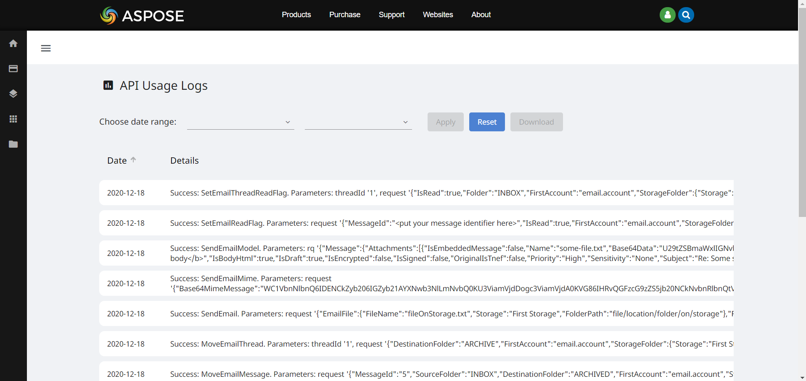
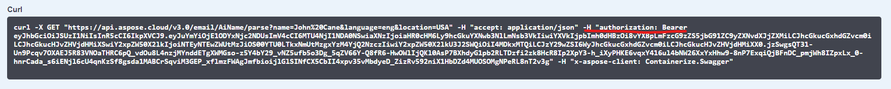

## **Aspose.Email Cloud API**
[Aspose.Email Cloud API](https://products.aspose.cloud/email/family) is a Cloud SDKs to send, receive, append, flag and convert cloud emails & support to create folder structure for email archiving in the cloud. This is easy to use and fast API, that doesn't need to install the additional software. The API supports many programming languages, such as C#, Java, PHP, Python, Ruby & Typescript. To start working with [Aspose.Email Cloud API](https://products.aspose.cloud/email/family) you need to install a proper SDK. To know how to install SDK follow the instructions below.
## **Install SDK**
SDK packages available at package repositories:

{} 
- [NuGet](https://www.nuget.org/packages/Aspose.Email-Cloud/)
- [Maven artifactory](https://repository.aspose.cloud/webapp/#/artifacts/browse/tree/General/repo/com/aspose/aspose-email-cloud)
- [PYPI](https://pypi.org/project/aspose-email-cloud/)
- [RubyGems](https://rubygems.org/gems/aspose_email_cloud)
- [NPM](https://www.npmjs.com/package/@asposecloud/aspose-email-cloud)
- [Packagist](https://packagist.org/packages/aspose/aspose-email-cloud)
{}


Use your package manager to install an SDK:

**How to install SDK?**





Use Package Manager:

```plain
PM> Install-Package Aspose.Email-Cloud 
```

Or .NET CLI:

```plain
dotnet add package Aspose.Email-Cloud
```

Or add a Package reference:

```xml
<PackageReference Include="Aspose.Email-Cloud"/>
```





First, add a repository:

```xml
<repository>
    <id>aspose-cloud</id>
    <name>Aspose.Cloud repository</name>
    <url>https://repository.aspose.cloud/repo</url>
</repository>
```

Then, add a dependency:

```xml
<dependency>
    <groupId>com.aspose</groupId>
    <artifactId>aspose-email-cloud</artifactId>
</dependency>
```





Use pip:

```plain
pip install aspose-email-cloud
```





Use gem:

```plain
gem install aspose_email_cloud
```





Use npm:

```plain
npm install @asposecloud/aspose-email-cloud --save
```





Use the composer:

```plain
composer require aspose/aspose-email-cloud
```




## **Get Your App Key and App SID**
Before we will get our **app Key** and **app SID**, let’s find out: what is it and what are they for?

Simply put, **app Key** is a login and **app SID** is a password. You can create more than one app and each one will have it’s own **app Key** and **app SID**. You can use these apps within your services. Using the [Aspose.Cloud Dashboard](https://dashboard.aspose.cloud/#/) helps you to filter the statistics of your applications in [**My Usage** section](https://dashboard.aspose.cloud/#/usage).

Here, you see the example of the apps’ statistics. In the APP column, you can see from which application was a request, also, there are details, size and sender’s IP address of a request.



**App Key** and **app SID** are used to get the temporary **JWT token**, which provides access to the API methods of Aspose.Email Cloud. These tokens can be seen in curl requests generated in the [Swagger UI](https://apireference.aspose.cloud/email/).

{}
Here you can see a screenshot of the Curl with JWT token:

{}

Our SDKs do not require you to receive these tokens again and again as they become obsolete. Instead, the **EmailCloud** class stores **app Key** and **app SID** in itself and receive a token by itself. If the token is out of date, Aspose.Email SDKs automatically receive a new one.

To get your **app Key** and **app SID** follow these steps:

1. Open the link of [Aspose.Cloud Dashboard](https://dashboard.aspose.cloud/#/)
1. Sign in or sign up
1. Open [link](https://dashboard.aspose.cloud/#/apps)
1. Now you can create a new app or use First App, which is already created for you.
1. Get **App SID** and **App Key** for your application to use them in SDK (you can also use them in our [Swagger UI](https://apireference.aspose.cloud/email/))

[Aspose.Cloud Dashboard](https://dashboard.aspose.cloud/#/) is a powerful tool where you can control your apps, storages and files.

{} 

For example, you can:

- **See all files** uploaded to the Storage [here](https://dashboard.aspose.cloud/#/files). 
- **Create** new storage [here](https://dashboard.aspose.cloud/#/storages).
- **Analyze** API usage [here](https://dashboard.aspose.cloud/#/usage).

{} 


## **Set up EmailCloud Object**
It is always convenient when everything is in one place. In our case, one of the main classes that will help us in development - [**EmailCloud**](https://github.com/aspose-email-cloud/aspose-email-cloud-dotnet/blob/master/docs/README.md).

All API methods are available in one [**EmailCloud**](https://github.com/aspose-email-cloud/aspose-email-cloud-dotnet/blob/master/docs/README.md) class. To initialize EmailCloud object we need to pass into it 2 required parameters: **App Key** and **App SID** (which are strings).

So, what are we waiting for, let's create an instance of it:

**How to set up EmailCloud object?**





```csharp
using Aspose.Email.Cloud.Sdk.Api; //EmailApi class is here
using Aspose.Email.Cloud.Sdk.Model; //REST API models are here

...

var appKey = "Your App Key";
var appSid = "Your App SID";
var api = new EmailCloud(appKey, appSid);
```





```java
import com.aspose.email.cloud.sdk.invoker.ApiException;
import com.aspose.email.cloud.sdk.model.*;
import com.aspose.email.cloud.sdk.api.*;

...

EmailCloud api = new EmailCloud("Your App Key", "Your App SID");
```





```python
from AsposeEmailCloudSdk import api, models

...

api = api.EmailCloud("app_key", "app_sid")
```





```ruby
require 'aspose-email-cloud'
include AsposeEmailCloud

...

@api = EmailCloud.new('appKey', 'appSid')
```





```javascript
import * as email from "@asposecloud/aspose-email-cloud";

...

var api = new email.EmailCloud('appSid', 'appKey');
```





```php
use Aspose\Email\EmailCloud;
use Aspose\Email\Configuration;
use Aspose\Email\Model;

...

$configuration = new Configuration();
$configuration
	->setAppKey("appKey")
	->setAppSid("appSid");

$api = new EmailCloud($configuration);
```





Our SDK automatically gets API token using your **AppKey** and **AppSid**. Also, it automatically gets a new token, if previous one is expired.

## **Check Everything Works**
After setting up Aspose.Email Cloud API SDK, it's time to start using it. The API has numerous functions for working with email messages, calendars, contacts, etc.. Also, the API includes AI functions such as the [Business Card Recognition API](/email/business-cards-recognition-api/) and [Name API](/email/working-with-name-api/). These features will facilitate and speed up the development of your application. 

Let’s call some SDK methods to see that everything set up properly. For example, you can easily convert an **EML** file to **MSG** format with our API.

[EmailApi](https://github.com/aspose-email-cloud/aspose-email-cloud-dotnet/blob/master/docs/EmailApi.md) object has a function to convert email messages, it’s called [*ConvertAsync*](https://github.com/aspose-email-cloud/aspose-email-cloud-dotnet/blob/master/docs/EmailApi.md#ConvertAsync) which converts email document to the specified format and returns as the file.

This function requires only one parameter — [*ConvertEmailRequest*](https://github.com/aspose-email-cloud/aspose-email-cloud-dotnet/blob/master/Model/EmailConvertRequest.cs), which requests a model for conversion. To create a request you need to pass **3 parameters**:
- toFormat - a **file format** you want to convert to (Enum: Eml, Msg, MsgUnicode, Mhtml, Html).
- fromFormat - a file format you want to convert from.
- file - a **file to upload** for the further converting. 

**How to convert EML to MSG?**





```csharp
using(var emlStream = File.OpenRead("email.eml"))
{
    var result = api.Email.ConvertAsync(new EmailConvertRequest(
        "Eml", "Msg", emlStream));
    //...
}
```





```java
byte[] fileToConvert = IOUtils.toByteArray(
    new FileInputStream("email.eml"));
byte[] result = api.email().convert(new EmailConvertRequest(
    "Eml", "Msg", fileToConvert));
```





```python
result = api.email.convert(
    models.EmailConvertRequest('Eml', 'Msg', 'email.eml'))
```





```ruby
result = api.email.convert(EmailConvertRequest.new(
    from_format: 'Eml', to_format: 'Msg', file: File.new('email.eml')))
```





```javascript
var result = api.email.convert(new EmailConvertRequest(
    'Eml', 'Msg', fs.readFileSync('email.eml')));
```





```php
$result = $api->email()->convert(new EmailConvertRequest(
    'Eml', 'Msg', 'email.eml'));
$fileContent = $result->fread($result->getSize());
```





Looks that everything is working. Now you can start the development!
## **Some Tips**
We still advise you to read all the documentation in order to fully master this API.

You can use the trial version of the Aspose.Email Cloud API to try it out. The trial version has some restrictions, so, if you need the full power of our solution — we will be happy to see you as one of our customers.

*Don't be shy to ask questions on our [free forum](https://forum.aspose.cloud/c/email) or the [special paid forum for our customers](https://helpdesk.aspose.cloud), we will answer as soon as possible and help to solve your problems.*
## **See More Tutorials**
Take a look at other tutorials, you may find answers on your questions there:

